# TOIB-PR4.2-KUZ
# Практическое задание на тему "Контроль целостности"
Выполнил(а) студент группы: ББМО-02-23 Кузина Анастасия Сергеевна
## Установка и запуск виртуальной машины с Astra linux
Для выполнения данного задания был скачан образ Astra Linux ( ссылка: https://1drv.ms/u/s!Ap1Ijs338IQ9gZFmLJ5hn45FgcVLoQ?e=mH7Jzg ) и установлена версия системы "Смоленск" с максимальным уровнем защиты

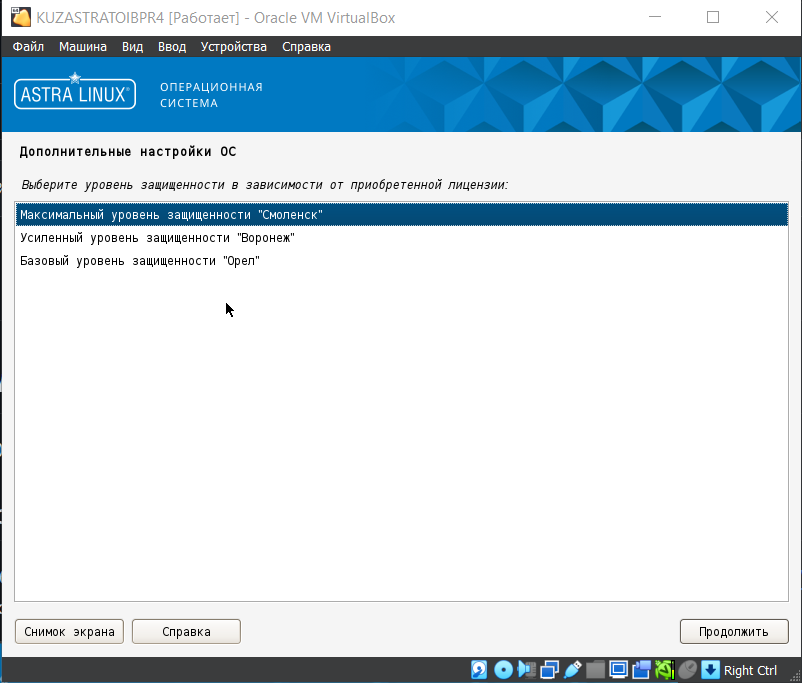

## Установка, настройка и проверка мандатного контроля целостности (МКЦ)
Для установки МКЦ в ОС Astra Linux выбираем указанные галочки в процессе установки ISO образа 

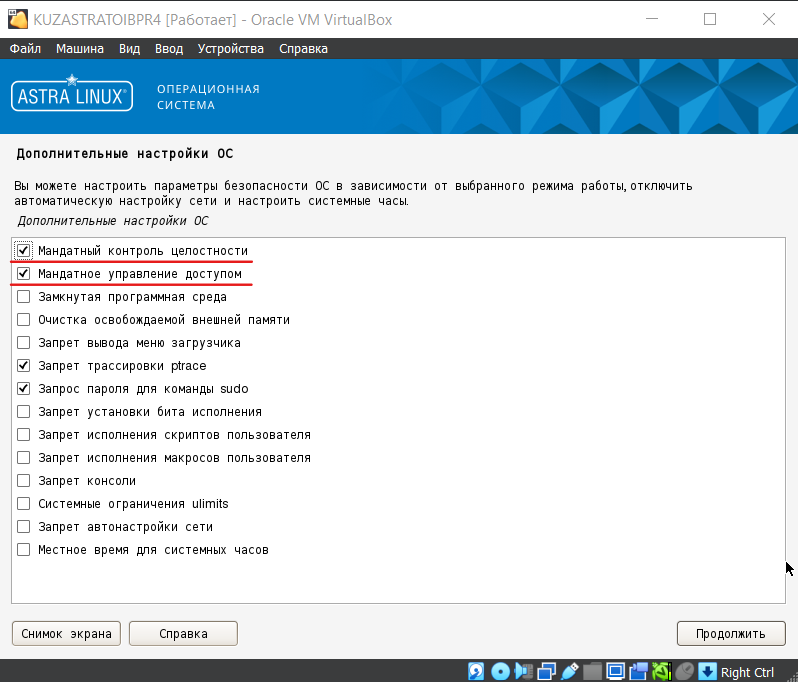

Для измнения конфигурации МКЦ в Astra Linux необходимо запустить утилиту "Управление политикой безопасности"

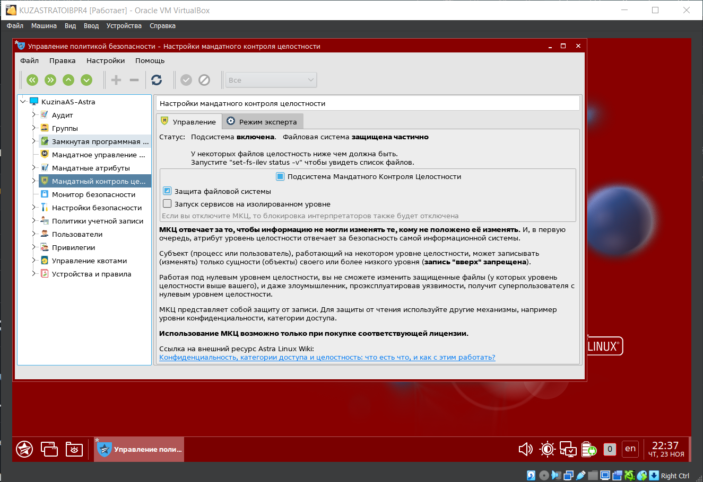

В меню "Режим эксперта" назначаем уровни целостности для директорий. В качестве проверки правила NWU обозначили 2 тестовые директории ("Музыка" и "Видео") с  правами:

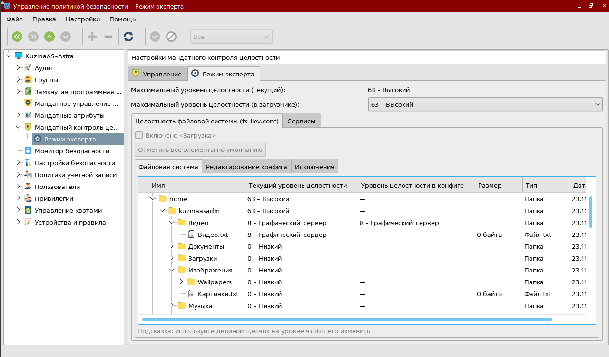

Проверяем настройку мандатного контроля зайдя в учетную запись с атрибутом целостности на уровне "Низкий".

Пример взаимодействия (записи) между тестовыми директориями:

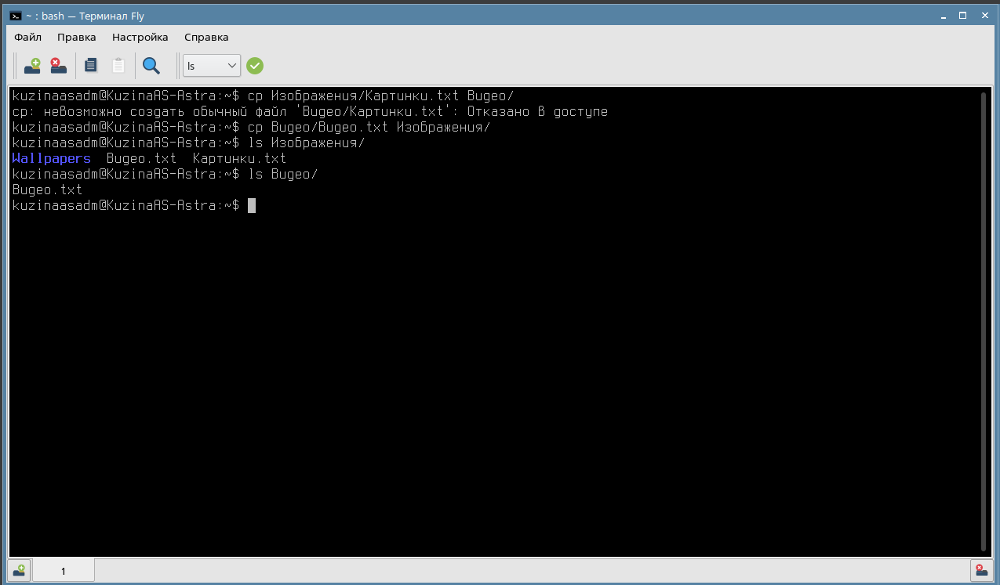

Здесь можно увидеть, что копирование файла с атрибутом ниже в папку с атрибутом выше не сработало - была получена ошибка доступа. В то же время "запись вниз" работает.
## Работа с режимом замкнутой программной среды (ЗПС)
Проверка работы режима ЗПС в утилите "Управлении политикой безопасности" посредством включения настроек:

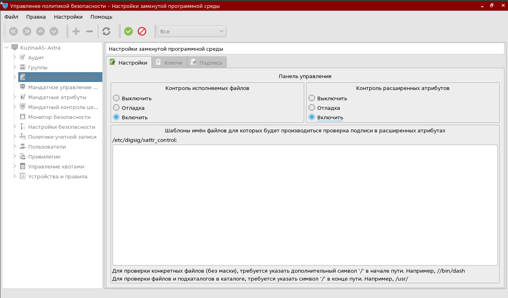

В качестве тестового файла был взят скрипт инициализации AnyDesk. Результат выполнения:

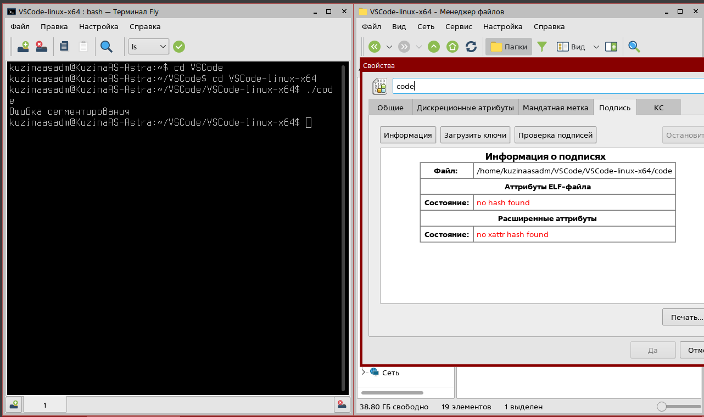

## Работа с утилитами контроля целостности и регламентного контроля целостности
### Использование `gostsum`
Утилита `gostsum` вычисляет хэш-сумму файлов в соответствии с ГОСТ Р 34.11-2012. Пример использования с .deb пакетом установки AnyDesk:

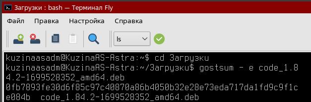

### Использование `afick`
`afick` - утилита, предназначенная для контроля целостности файловой системы ОС. Для корректной работы утилиты сначала создаём БД утилиты:

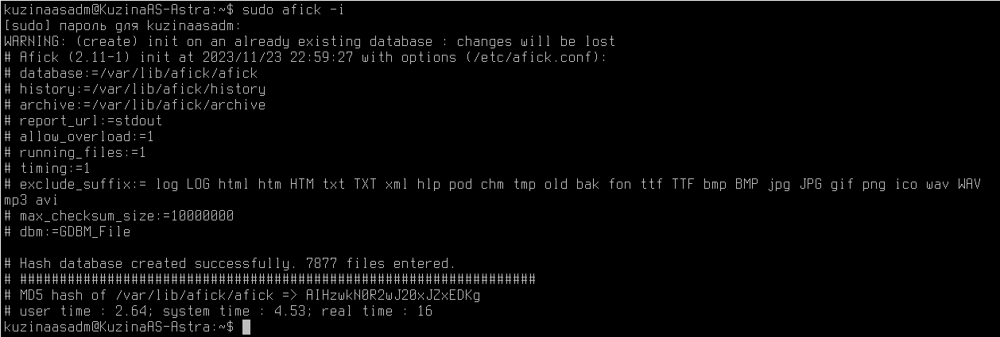

Далее изменяем часть системных файлов для получения ответа от утилиты, перед этим делаем "бэкап" файл:

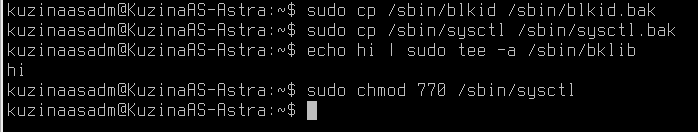

Получаем результат от утилиты:

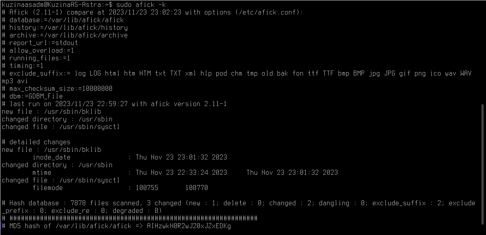

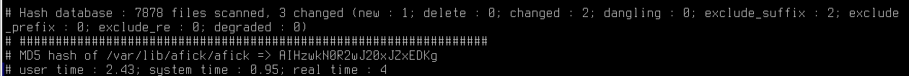
